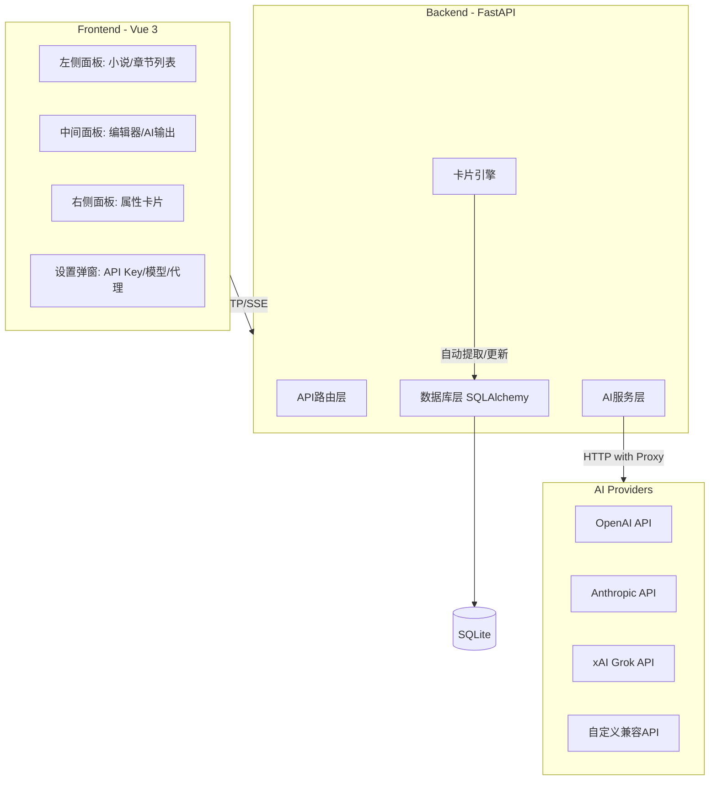
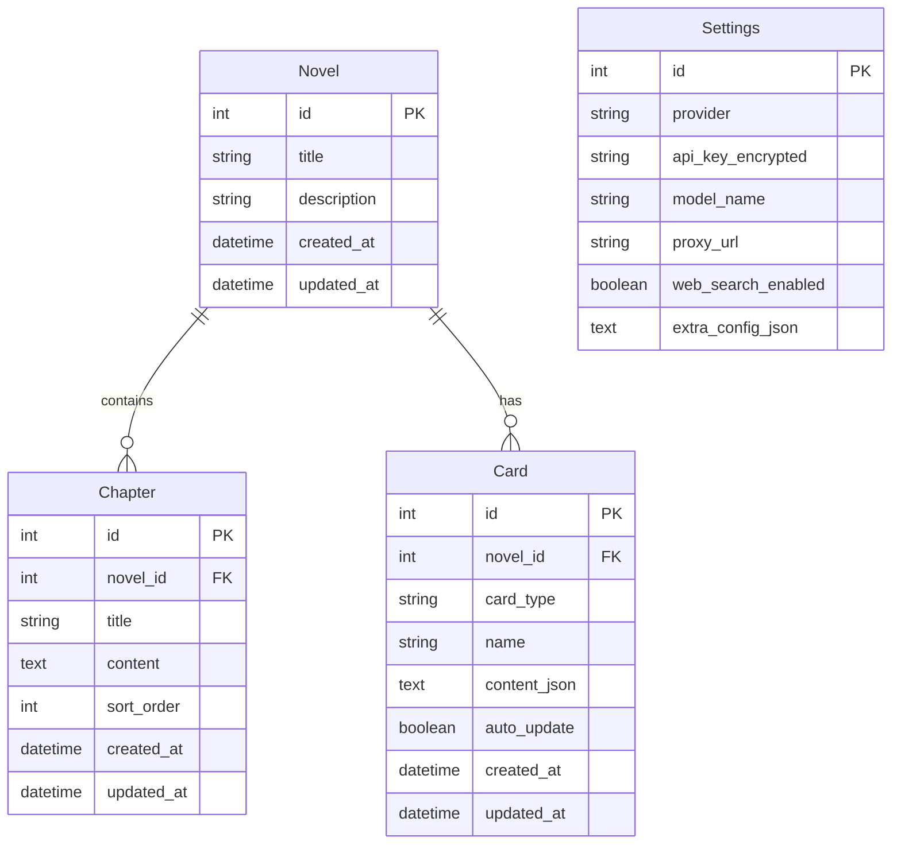
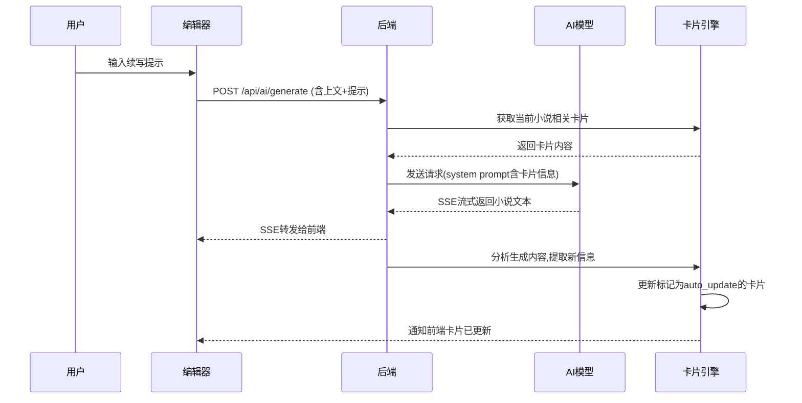

# AI 小说助手 (AInovel-Master) 开发计划

## 整体架构




## 项目目录结构

```
AInovel-Master/
├── frontend/                  # Vue 3 前端
│   ├── src/
│   │   ├── components/
│   │   │   ├── LeftPanel/     # 小说列表、章节列表
│   │   │   ├── CenterPanel/   # 文本编辑器、AI输出
│   │   │   ├── RightPanel/    # 属性卡片栏
│   │   │   └── Settings/      # API设置弹窗
│   │   ├── stores/            # Pinia 状态管理
│   │   ├── api/               # 后端API调用封装
│   │   ├── types/             # TypeScript类型定义
│   │   └── App.vue
│   ├── package.json
│   └── vite.config.ts
├── backend/                   # FastAPI 后端
│   ├── app/
│   │   ├── main.py            # FastAPI入口
│   │   ├── routers/           # API路由
│   │   │   ├── novels.py      # 小说CRUD
│   │   │   ├── chapters.py    # 章节CRUD
│   │   │   ├── cards.py       # 卡片CRUD
│   │   │   └── ai.py          # AI生成接口
│   │   ├── models/            # SQLAlchemy ORM模型
│   │   ├── schemas/           # Pydantic请求/响应模型
│   │   ├── services/          # 业务逻辑
│   │   │   ├── ai_service.py  # AI调用服务(含代理支持)
│   │   │   └── card_engine.py # 卡片自动更新引擎
│   │   └── database.py        # 数据库连接配置
│   └── requirements.txt
├── docker-compose.yml
├── Dockerfile
└── README.md
```

## 数据模型设计




- **card_type** 枚举: `character`(角色), `worldview`(世界观), `setting`(设定), `plot`(剧情线), `custom`(自定义)
- **content_json** 为 JSON 格式，不同 card_type 有不同的字段模板（如角色卡包含：姓名、外貌、性格、背景故事等）

## 核心功能模块详解

### 1. AI 接入与代理支持

**后端 `[backend/app/services/ai_service.py](backend/app/services/ai_service.py)`**:

- 使用 `httpx.AsyncClient` 统一调用各AI Provider的 API，支持配置 HTTP/SOCKS5 代理
- 代理配置方式：用户在前端设置中填写代理地址（如 `http://127.0.0.1:7890`），后端使用该代理转发请求
- 支持 OpenAI 兼容格式的 API（OpenAI、Grok/xAI、DeepSeek 等共用同一套调用逻辑，仅 base_url 不同）
- Anthropic 单独适配其 Messages API 格式
- 联网搜索：对支持 web_search 工具的模型（如 Grok），在请求中附加 `tools: [{type: "web_search"}]` 参数
- 所有 AI 调用均采用 **SSE (Server-Sent Events)** 流式输出，实现打字机效果

```python
# ai_service.py 核心逻辑示意
async def stream_generate(prompt, context, cards, settings):
    proxy = settings.proxy_url or None
    async with httpx.AsyncClient(proxy=proxy, timeout=120) as client:
        # 构建 system prompt，注入相关卡片内容
        system = build_system_prompt(cards)
        # SSE 流式请求
        async with client.stream("POST", base_url + "/chat/completions", ...) as resp:
            async for line in resp.aiter_lines():
                yield parse_sse_chunk(line)
```

### 2. 三栏式页面布局

**左侧面板 `[frontend/src/components/LeftPanel/](frontend/src/components/LeftPanel/)`**:

- `NovelList.vue`: 小说列表，支持新建、重命名、删除
- `ChapterList.vue`: 当前小说的章节列表，支持拖拽排序、新建、删除
- 点击章节加载内容到中间编辑器

**中间面板 `[frontend/src/components/CenterPanel/](frontend/src/components/CenterPanel/)`**:

- `NovelEditor.vue`: 基于 contenteditable 或集成轻量富文本编辑器（如 Tiptap），展示和编辑章节正文
- `PromptInput.vue`: 底部输入框，用户输入续写提示
- `StreamOutput.vue`: AI 流式输出区域，实时展示生成内容，生成完毕后合并入编辑器
- 用户可以编辑上文内容，编辑后的内容作为后续 AI 生成的上下文

**右侧面板 `[frontend/src/components/RightPanel/](frontend/src/components/RightPanel/)`**:

- `CardList.vue`: 当前小说所有卡片分类展示（角色、世界观、设定等）
- `CardEditor.vue`: 卡片编辑弹窗/抽屉，结构化表单编辑
- 卡片上有"自动更新"开关，开启后 AI 生成过程中会自动更新该卡片

### 3. 卡片引擎（核心亮点）

**后端 `[backend/app/services/card_engine.py](backend/app/services/card_engine.py)`**:

工作流程：




- **注入机制**: AI 生成时，将所有相关卡片内容注入 system prompt，确保 AI 了解角色设定、世界观等
- **自动更新机制**: 生成完一段文本后，调用 AI 分析该段文本，提取新出现的角色信息、世界观变化等，更新对应卡片
- **智能召回**: 根据用户输入的提示词和上下文，自动判断哪些卡片与当前场景相关，优先注入这些卡片（避免 token 浪费）

### 4. 代理/VPN 支持方案

- 后端所有对外 AI API 请求均通过 `httpx` 发出，支持 `http_proxy`/`socks5` 参数
- 前端设置页面提供"代理地址"输入框，保存到 Settings 表
- Grok (xAI) API base_url: `https://api.x.ai/v1`，走 OpenAI 兼容格式
- Docker 部署时，可通过环境变量 `HTTP_PROXY`/`HTTPS_PROXY` 或前端设置指定代理

## 技术栈明细


| 层           | 技术                        |
| ----------- | ------------------------- |
| 前端框架        | Vue 3 + TypeScript + Vite |
| UI 组件库      | Element Plus（或 Naive UI）  |
| 状态管理        | Pinia                     |
| 富文本编辑       | Tiptap (基于 ProseMirror)   |
| 后端框架        | FastAPI + Uvicorn         |
| ORM         | SQLAlchemy 2.0 (async)    |
| 数据库         | SQLite (aiosqlite)        |
| AI HTTP 客户端 | httpx (支持代理/流式)           |
| 部署          | Docker + docker-compose   |


## 部署方案

**本地开发 (Windows)**:

- 前端: `cd frontend && npm run dev` (Vite dev server, 端口5173)
- 后端: `cd backend && uvicorn app.main:app --reload` (端口8000)
- Vite 配置代理将 `/api` 转发到后端

**Docker 部署 (Linux)**:

- `[Dockerfile](Dockerfile)`: 多阶段构建，先构建前端静态文件，再打包到 Python 镜像中由 FastAPI 静态文件服务
- `[docker-compose.yml](docker-compose.yml)`: 单容器部署，SQLite 数据文件挂载到宿主机 volume
- 支持环境变量配置代理、端口等

```yaml
# docker-compose.yml 示意
services:
  ainovel:
    build: .
    ports:
      - "8080:8000"
    volumes:
      - ./data:/app/data    # SQLite数据持久化
    environment:
      - HTTP_PROXY=${HTTP_PROXY:-}
```

## 开发阶段划分

项目按以下顺序分阶段实施，每阶段产出可运行的版本：

- **阶段一**: 项目脚手架 -- 初始化前后端项目、数据库模型、基础三栏布局、Docker 配置
- **阶段二**: 小说/章节管理 -- 左侧面板完整的 CRUD、中间编辑器基础功能
- **阶段三**: AI 接入 -- API Key 设置、模型选择、代理配置、SSE 流式生成、联网搜索
- **阶段四**: 卡片系统 -- 右侧卡片栏、卡片 CRUD、AI 生成时注入卡片、自动更新卡片
- **阶段五**: 体验优化 -- 拖拽排序、自动保存、错误处理、UI打磨、响应式适配

